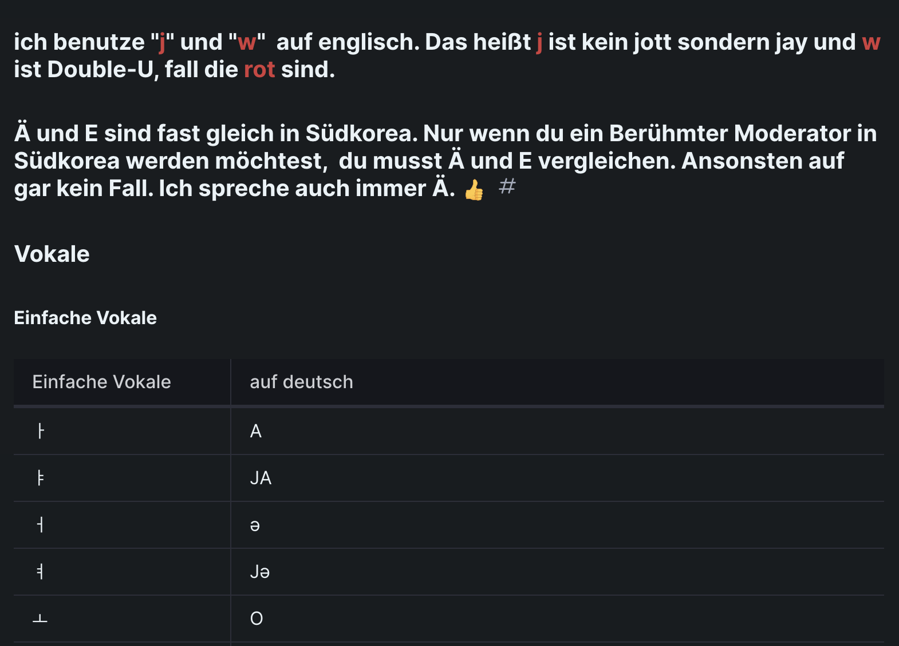

# Lernen Sie Koreanisch auf Deutsch !!!

Haben Sie Bock auf Koreanisch??
Dann lernen Sie mit mir!!

[WEBSITE](https://ddiddabbu.gitbook.io/ko/grund/readme)

1. Genaue Phonetik für Deutsche
2. Mit [Youtube Tutorial](https://www.youtube.com/watch?v=KnCq8eHtBfI&ab_channel=%EB%8F%85%EC%9D%BC%EB%A7%A5%EC%A3%BC)
3. Ich bin Mutterspracher
4. Kostenlos aber bitte buy me a coffee.. Ich bin nur ein Student.... ㅠㅜㅠㅜㅠㅜ 
[buy me a coffe](https://www.buymeacoffee.com/huansock)

## Homepage

## Stufe
- Grund ✓
- a1 bearbeitung
- a2
- b1
- b2

## Haben Sie Fragen??

Schreiben Sie es mir

dogilmekju@gmail.com

## [tiktok](https://www.tiktok.com/@dogil_mekju) 
