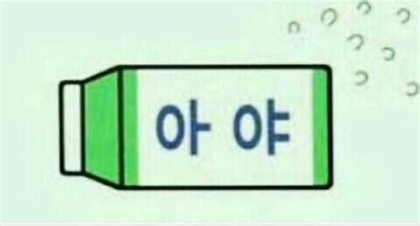

# 한글 - 1

auf deutsch, Hang~~u~~l.

### ich benutze "<mark style="color:red;">j</mark>" und "<mark style="color:red;">w</mark>"  auf englisch. Das heißt <mark style="color:red;">j</mark> ist kein jott sondern jay und <mark style="color:red;">w</mark> ist Double-U, fall die <mark style="color:red;">rot</mark> sind. &#x20;

### Ä und E sind fast gleich in Südkorea. Nur wenn du ein Berühmter Moderator in Südkorea werden möchtest,  du musst Ä und E vergleichen. Ansonsten auf gar kein Fall. Ich spreche auf immer Ä. :thumbsup:

### Vokale

#### Einfache Vokale

| Einfaches Vokale | auf deutsch |
| ---------------- | ----------- |
| ㅏ                | A           |
| ㅑ                | JA          |
| ㅓ                | ə           |
| ㅕ                | Jə          |
| ㅗ                | O           |
| ㅛ                | JO          |
| ㅜ                | U           |
| ㅠ                | JU          |
| ㅡ                | ~~U~~       |
| ㅣ                | I           |

**ㅏ = a**&#x20;

So lass uns Koreanisch lernen. du hast schon ein Vokal gelernt. wie geil!! \
In Korea wenn man ein Streich addiert dann addieren wir auch "j".

zum Beispiel:

**ㅑ = ja**&#x20;

ja. genau du hast schon zwei Vokalen gelernt.  sehr gut.

**ㅓ =** [**ə**](https://de.wikipedia.org/wiki/Liste\_der\_IPA-Zeichen#%C9%99)****

Sprechen Sie jetzt die Falle\[fa:lə] aus. ja genau!. In diesem Fall sprechen wir nicht \[falle] , sondern \[fa:lə]. das Wort Andere\[Andərə] ist auch so. ja dieses "**ə**" ist was ich meinte. sehr gut. \
\
zusatz: [https://de.wikipedia.org/wiki/Schwa](https://de.wikipedia.org/wiki/Schwa)\
\
**ㅕ = jə** \
\
natürlich oder? ein horizontale Streich bedeutet "j" wie immer.\
\
**ㅗ = o**&#x20;

dann

**ㅛ = jo**

jo. natürlich jo ist jo!

**ㅜ = u**

dann? was ist ㅠ?

**ㅠ = ju**

jetzt kommt eine Herausforderung.&#x20;

**ㅡ = **~~**u**~~

<figure><figcaption>
IPA
</figcaption></figure>

~~**u**~~ steht  in der Mitte am höchsten. \
Hören Sie es mal erst!

[https://ko.dict.naver.com/#/entry/koko/dd508b1ae8d0424bb7d9b3dee5acd9fa](https://ko.dict.naver.com/#/entry/koko/dd508b1ae8d0424bb7d9b3dee5acd9fa)\
\
Ja. Ihrer Mund muss fast geschlossen (aber machen Sie es nicht so hart, sondern natürlich) und bitte Sprechen Sie sehr langsam von U nach I. und I nach U. Dazwischen versteckt ~~U~~ .

Dann Sie können sich selbst fühlen , dass ihre Zunge bewegt vorne und hinten.&#x20;

<mark style="background-color:yellow;">Die Dumme schreiben es als Englisch wie 'EU' , bitte Vergiss es. Es ist falsch.</mark> \
Und ich weiß es schon, ~~u~~ auszusprechen ist so hart. Jedoch ist es egal und natürlich. \
Ich (der fünf Jahre Deutsch gelernt habe und studiere) kann nicht R auf Deutsch aussprechen. hahaha\
\
l = i (und es spielt wie Umlaut!)

WTF? gibt es Umlaut in koreanisch? <- ja natürlich!.&#x20;

#### Umlaut und <mark style="color:red;">W</mark>

<mark style="color:red;"></mark>

umlaut:

Betrachten Wir das Umlaut von **ə** als **Ä !!!**

| Einfache Vokale | + l (i) | Deutsch |
| --------------- | ------- | ------- |
| ㅏ(A)            | ㅐ       | Ä       |
| ㅑ(JA)           | ㅒ       | JÄ      |
| ㅓ(ə)            | ㅔ       | Ä       |
| ㅕ(Jə`)`         | ㅖ       | JÄ      |
| ㅗ(O)            | ㅚ       | Ö       |
| ㅜ(U)            | ㅟ       | Ü       |

Anwendung von <mark style="color:red;">W</mark> :

In disem Fall 'O' und 'U' verwechseln sich als <mark style="color:red;">W(Double-U)</mark> auf Englisch.

| Einfache Vokale | Anwendungen | Aussprache                         |
| --------------- | ----------- | ---------------------------------- |
| ㅗ(O)            | ㅘ           | <mark style="color:red;">W</mark>A |
| ㅗ(O)            | ㅙ           | <mark style="color:red;">W</mark>Ä |
| ㅜ(U)            | ㅝ           | <mark style="color:red;">W</mark>ə |
| ㅜ(U)            | ㅞ           | <mark style="color:red;">W</mark>Ä |

Sie wissen es schon warum **ㅐund ㅔ = Ä** ist. oder? &#x20;



#### Schwierigster Vokal

| Koreanisch | Zerlegung       | Deutsch |
| ---------- | --------------- | ------- |
| ㅢ          | ㅡ (~~u~~)+ ㅣ(i) | ~~u~~ i |

Dafür haben wir u nach i geübt. Bitte Sprechen Sie jetzt von ~~U~~ nach I. \
Deine Zunge bewegt von der Mitte nach vorne. Wenn du es als eu gelernt. Du hast falsch gelernt.&#x20;

DAS WAR'S !!! Herzlichen Glückwunsch du hast Alle Vokale in Koreansich gelernt. \
so einfach  ㅏa ㅓə ㅗo ㅜu ㅡ~~u~~ ㅣi mit j , mit Umlaut, mit <mark style="color:red;">W</mark>.

\
Nächstens mal lernen wir Konsonanten , und es ist einfacher als Dies.\
Davor Du musst die Schreibweise wissen. \
\
ich bringe dir jetzt ein Konsonant. \
\
'ㅇ' hat Zwei Aussprachen. \
\
**An der Stelle 1 spricht man es nicht.**\
**An der Stelle 3 spricht man es wie 'ng'**\
\
HÄ? Was ist die Stelle? <- okay ich zeige Ihnen.\
\
.png>)

Die sind Schreibweise.&#x20;

우 = U&#x20;

Schauen Sie erste linke Zeile. ja in diesem fall o steht an der 1. und ㅜ steht an der 2. IN '우'.&#x20;

An der Stelle 1 spricht man es nicht. <- du hast es nicht vergessen oder?

Deswegen wir sprechen nur 'U'. Ja es ist gleich wie H in Hour auf Englisch. Aber wir sind Genauer. \

Was denkst du denn über 웅?. ja du hast recht. 'UNG' ist wahr.\

ja dann 아. wie spricht man es? ja genau 'A'.

letztens mal wie spricht man 앙 ?   ja stimmt. 'ANG'

Weißt du eine Anime A-Ang? wir schreibenn es wie 아앙. wie cool oder? sei ehrlich, meine Freundin ist ein Fan von A Ang. hahaha\
\
\
Okay Du hast fast alles gelernt. Ich gebe euch ein Quiz. \
우유\[U:JU] ist das Milch auf Koreanisch. \
dann wie heißt 우유, wenn es fällt?\
\
\
Hint!

<figure><figcaption></figcaption></figure>

Sauchen Sie das Antwort in meinen Tiktok an!

tiktok



youtube



