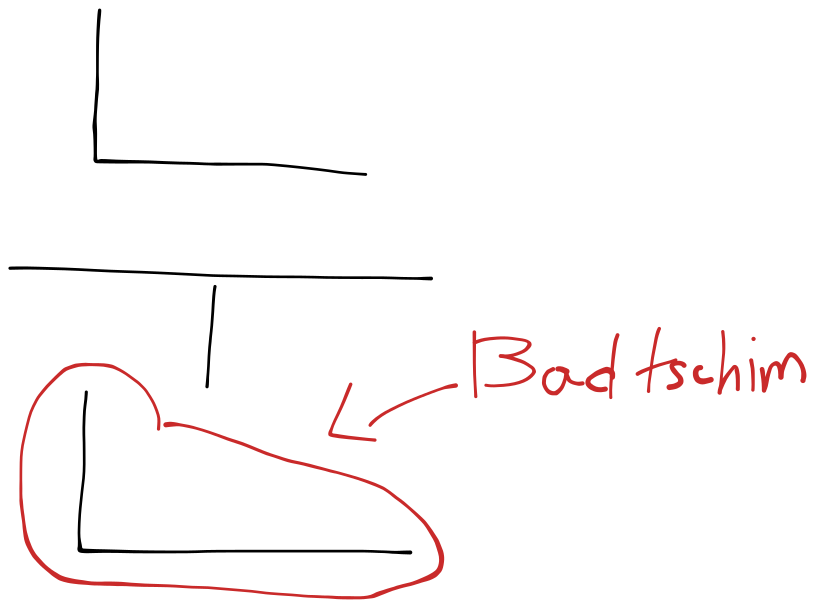

# 받침 (Badtschim)

## Bedeutung des 받침

Nun lernen wir Badtschim.\
Aber was ist Badtschim? Sie wiessen es schön, dass ein koreansiches Zeichen auf drei Teilen besteht.&#x20;

Kosonant + Vokal + Kosonant. oder Einfach Kosonant + Vokal. wie "나"

Nun schauen Wir ein Zeichen an.

Lezter Konsonant heißt 받침\[badtschim].\
In dieser Situation ㄴ ist unser 받침.

## 7 Badtschim

Ariana Grande hat 7 Rings. Dagegen haben wir nur 7 Badtschim , das wir aussprechen.

**ㄱ, ㄴ, ㄷ, ㄹ, ㅁ, ㅂ, ㅇ**

****

Beispiel: 국, 눈 , 곧, 달 , 맘, 응.

국 = die Suppe

눈 = das Auge , der Schnne&#x20;

돈 = das Geld

곧 = Bald

달 = der Mond

맘 = das Hertz(geistig)

응 = ja(freundlich)

## Doppelte Zeichen , Starke Zeichen

