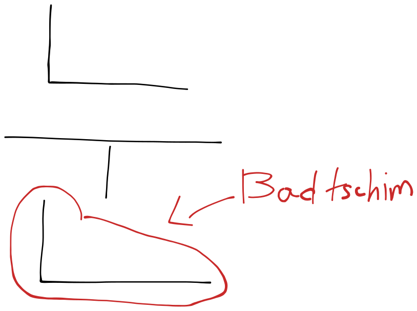
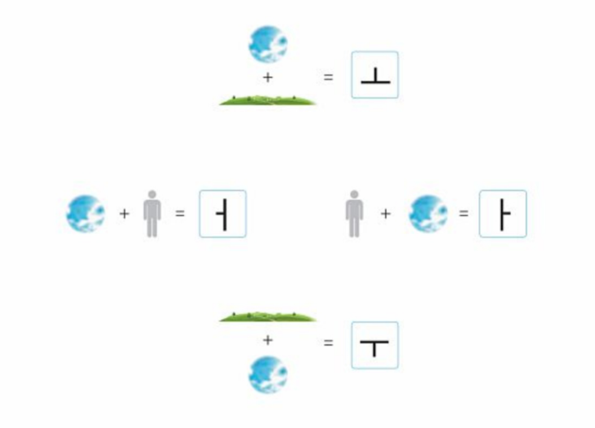

# 받침 (Badtschim)


bitte...


## Bedeutung des 받침

Nun lernen wir Badtschim.\
Aber was ist Badtschim? Sie wiessen es schön, dass ein koreansiches Zeichen auf drei Teilen besteht.&#x20;

Kosonant + Vokal + Kosonant. oder Einfach Kosonant + Vokal. wie "나"

Nun schauen Wir ein Zeichen an.

<mark style="background-color:yellow;">Lezter Konsonant heißt 받침</mark>\[badtschim].\
In dieser Situation ㄴ ist unser 받침.

## 7 Badtschim

Ariana Grande hat 7 Rings. Dagegen haben wir nur 7 Badtschim , das wir aussprechen.

<mark style="background-color:yellow;">**ㄱ, ㄴ, ㄷ, ㄹ, ㅁ, ㅂ, ㅇ**</mark>

****

Beispiel: 국, 눈 , 곧, 달 , 맘, 응.

국 = die Suppe

눈 = das Auge , der Schnne&#x20;

돈 = das Geld

곧 = Bald

달 = der Mond

맘 = das Hertz(geistig)

응 = ja(freundlich)

## Doppelte Zeichen , Starke Zeichen, Andere

<figure><figcaption></figcaption></figure>

Denn

ㄱ < ㄲ < ㅋ

ㅂ < ㅍ

Beispiel: 꽃, 앞, 옷

꽃\[꼳]: die Blume

앞\[압]: Vorderer Teil

옷\[옫]: die Kleidung

## Vermischte Zeichen

<mark style="background-color:yellow;">ㄳ, ㄵ, ㄼ, ㄽ, ㄾ, ㅄ,ㄺ, ㄻ, ㄿ</mark>

Lernen Sie es wie Diagram.

<figure><figcaption></figcaption></figure>

##

## Zusatz!

\~이 und \~가 sind sozusagen Subjekt-Hilfswort.

Hilfswörter verwinden sich mit andere Nomen.

Anwendung:

꽃&#x20;

wenn Sie das als Subjekt benutzen wollen, können Sie \~이 hinzufügen.

꽃 + \~이 = 꽃이

Dann wie spricht man 꽃이 ?

denn 받침 ㅊ sich als ㄷ verwechselt, ist es \[꼳이]?

**Nein!**

wenn **ein Nomen** mit **Vokale-Hilfswörter** zusammen verwindet, schieben wir einfach das 받침 danächts.

Daher 꽃이 ist \[꼬치].

**Vokale-Hilfswörter = \~이, \~아, \~을, \~어, \~에 , \~으**&#x20;

Lernen Sie **nicht** die Vokale-Hilfswörter Liste auswendig!!!

Das war's!!! \
\
folgend lernen wir Begrüßung !

\
Tiktok



youtube


